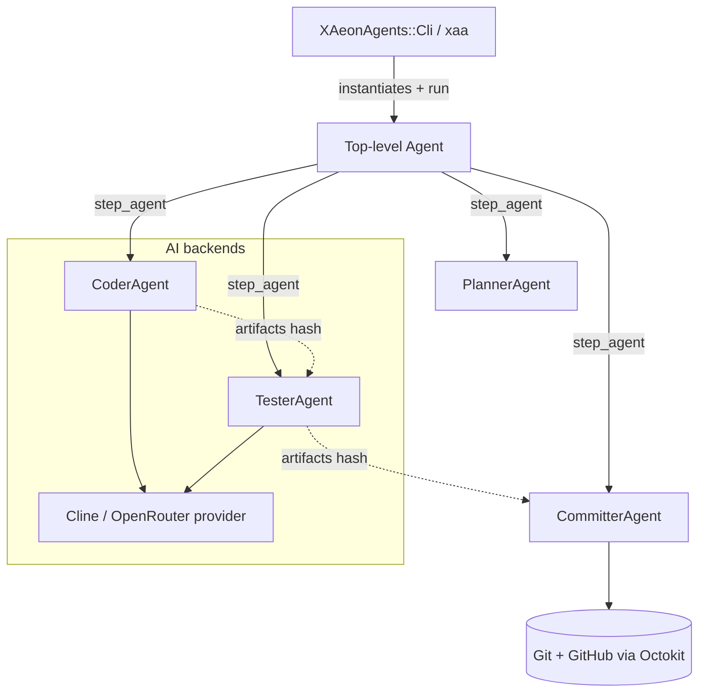

<div align="center">

# x_aeon_agents

**x_aeon_agents** is a Ruby gem and CLI that arms AI assistants with ready-to-use skills to automate everyday development workflows for X-Aeon projects.

[](https://github.com/Muriel-Salvan/x_aeon_agents/actions/workflows/continuous_integration.yml)
[](https://codecov.io/gh/Muriel-Salvan/x_aeon_agents)
[](https://github.com/Muriel-Salvan/x_aeon_agents/stargazers)
[](LICENSE)
[](https://rubygems.org/gems/x_aeon_agents)
[](https://rubygems.org/gems/x_aeon_agents)

</div>

**x_aeon_agents** is a 💎 Ruby gem that gives AI assistants a **ready-to-use skill set** so they can automate everyday development workflows for X-Aeon projects. 🤖

Powered by the `xaa` command-line interface (and usable as a library too), it takes care of:

- 📬 **Pull Request reviews** — automatically read, address and reply to GitHub review comments
- 📝 **Commit messages** — generate meaningful descriptions for your staged changes
- 📚 **README generation** — build documentation sections straight from your codebase
- 🔍 **Git diff interpretation** — summarize what changed and why
- 🚀 **Issue implementation** — turn GitHub issues into working code
- 🛠️ **Task bootstrapping** — create git worktrees and feature branches in seconds
- 🔧 **Skill templating** — generate reusable agent workflows from ERB templates

Use it as a **⚡ CLI** in your terminal or as a **📦 library** inside your Ruby projects.

## Table of contents

- [Quick start](#quick-start)
  - [Prerequisites](#prerequisites)
  - [Install](#install)
  - [Configure](#configure)
  - [Use the CLI](#use-the-cli)
  - [Use as a library](#use-as-a-library)
- [Requirements](#requirements)
- [Features](#features)
- [Public API](#public-api)
  - [Executable: `xaa`](#executable-xaa)
  - [`XAeonAgents::Config`](#xaeonagentsconfig)
  - [`XAeonAgents::AgentOptions`](#xaeonagentsagentoptions)
  - [`XAeonAgents::GenHelpers`](#xaeonagentsgenhelpers)
- [Documentation](#documentation)
  - [Library public API](#library-public-api)
- [How it works](#how-it-works)
  - [Entry point 🚪](#entry-point-)
  - [Agents as composable workflows 🧩](#agents-as-composable-workflows-)
  - [Orchestration 🔗](#orchestration-)
  - [Configuration & providers 🔐](#configuration--providers-)
  - [Skills & ERB templating 📚](#skills--erb-templating-)
  - [Helpers 🛠️](#helpers-)
- [Development](#development)
  - [Prerequisites](#prerequisites-1)
  - [Clone and install dependencies](#clone-and-install-dependencies)
  - [Project layout](#project-layout)
  - [Running the test suite](#running-the-test-suite)
  - [Linting](#linting)
  - [Building skills from templates](#building-skills-from-templates)
  - [Common development tasks](#common-development-tasks)
  - [Packaging and release](#packaging-and-release)
- [Contributing](#contributing)
  - [🐛 Reporting issues](#-reporting-issues)
  - [🍴 Forking & branching](#-forking--branching)
  - [🧪 Running the tests](#-running-the-tests)
  - [🔀 Opening a Pull Request](#-opening-a-pull-request)
  - [🤖 CI & coverage](#-ci--coverage)
  - [🧹 Code style](#-code-style)
  - [✅ Before you submit](#-before-you-submit)
- [License](#license)
- [Ways skills are written](#ways-skills-are-written)
- [General principles](#general-principles)
- [Generating skills from ERB templates](#generating-skills-from-erb-templates)

## Quick start

### Prerequisites

- Ruby `>= 3.1`
- An OpenRouter API key (`OPENROUTER_API_KEY`) so the built-in agents can call an LLM
- A GitHub token (`GITHUB_TOKEN`) for features that talk to GitHub (Pull Requests, issues, comments)
- Optionally a Cline API key (`CLINE_API_KEY`) when driving the Cline agent

### Install

Install the gem from RubyGems:

```bash
gem install x_aeon_agents
```

Or add it to your project's `Gemfile` and install with Bundler:

```ruby
gem 'x_aeon_agents'
```

```bash
bundle install
```

### Configure

Export the required credentials as environment variables (the CLI reads them automatically):

```bash
export OPENROUTER_API_KEY="sk-or-..."
export GITHUB_TOKEN="ghp_..."
```

### Use the CLI

The `xaa` command is installed alongside the gem. Run it from inside any Git repository.

Commit your staged changes with an AI-generated message:

```bash
xaa commit
```

Address GitHub Pull Request review comments (auto-detected from the current branch):

```bash
xaa review-comments
```

Push your branch and open a Pull Request:

```bash
xaa create-pr
```

Generate or update the project README from the codebase:

```bash
xaa generate-readme
```

Ask a quick one-off question to the agent:

```bash
xaa prompt "What is the capital of France?"
```

Bootstrap a new task in a git worktree:

```bash
xaa start-task --branch feature/my-task
```

### Use as a library

Require the gem and configure it in your Ruby code:

```ruby
require 'x_aeon_agents'

XAeonAgents::Config.configure(
  openrouter_api_key: ENV['OPENROUTER_API_KEY'],
  github_token: ENV['GITHUB_TOKEN']
)

# Trigger agents programmatically
XAeonAgents::Agents::CommitterAgent.new.run
```

## Requirements

- **Ruby** `>= 3.1` — the `xaa` CLI and library are Ruby-based (RubyGems/Bundler needed to install the gem)
- **Git** command-line client in `PATH` — the agents operate on repositories, branches, worktrees and commits
- **GitHub CLI (`gh`)** installed and authenticated — used by the Pull Request and comment skills to query and reply via `gh api`
- **`GITHUB_TOKEN`** environment variable — a GitHub personal access token used by Octokit for API access
- **`OPENROUTER_API_KEY`** environment variable — an OpenRouter API key that powers the AI agents through RubyLLM
- **`CLINE_API_KEY`** environment variable (optional) — only required when driving the Cline agent integration

## Features

**x_aeon_agents** provides a *`xaa`* command-line interface and a reusable Ruby library that package a suite of AI agents to automate everyday development workflows.

- 📬 **Pull Request review handling** — auto-detect the PR for the current branch, read agent-addressed comments, fix the code and reply to each thread
- 📝 **AI commit messages** — analyze staged changes and generate a meaningful message, with flexible staging strategies (`all`, `if_empty`, `none`)
- 🚀 **Automated Pull Request creation** — push the branch to GitHub and open a PR against a configurable base ref with an AI-written description
- 📚 **README generation** — build a full README from the codebase with toggleable sections (about, quick start, requirements, features, public API, documentation, how-it-works, development, contributing, license)
- 🐛 **GitHub issue implementation** — turn an issue (and its comments) into working code, committing changes and opening a PR automatically
- 🛠️ **Arbitrary requirement implementation** — pass free-form requirements to a Developer agent that edits the codebase, optionally committing and opening a PR
- 🔍 **Git diff interpretation** — summarize the working tree changes and the intent behind them relative to any base ref
- 💬 **One-shot prompts** — send a single prompt to the AI agent and print the response
- 🔧 **Skill templating** — generate skill files from ERB templates, evaluating templates and copying assets to the output directory
- 📥 **Skill installation** — install skills and their recursively-resolved dependencies from a manifest for a chosen agent
- 🌿 **Task bootstrapping** — create a feature branch, set up a git worktree, push it upstream and open it in the editor
- 📦 **Reusable Ruby library** — require the gem and trigger agents programmatically (e.g. `Agents::CommitterAgent.new.run`)
- 🧩 **Agent framework & provider integration** — composable agents built on `ai-agents`/`composable_agents`, a Cline/OpenRouter provider, central `Config`, helpers and `GenHelpers`
- 💾 **Session persistence & debugging** — global `--session-id` for conversation persistence and a `--debug` flag for verbose logging

## Public API

x_aeon_agents exposes a command-line executable and a set of Ruby library entry points. Only the components below are part of the public API (methods tagged in the `Public API` YARD group).

### Executable: `xaa`

The `bin/xaa` script is the entry point of the CLI. It boots the gem and dispatches `ARGV` to `XAeonAgents::Cli`.

**Usecase** — commit staged changes with an AI-generated message:

```bash
xaa commit
```

More details: [GitHub — bin/xaa](https://github.com/Muriel-Salvan/x_aeon_agents/blob/main/bin/xaa)

### `XAeonAgents::Config`

Singleton holding all configuration of X-Aeon Agents (secrets, data directory, CLI defaults, debug flag). All methods below are part of the public API.

**Usecase** — configure credentials and options at once:

```ruby
require 'x_aeon_agents'

XAeonAgents::Config.configure(
  openrouter_api_key: ENV['OPENROUTER_API_KEY'],
  github_token: ENV['GITHUB_TOKEN'],
  debug: false
)
```

More details: [RubyDoc — XAeonAgents::Config](https://www.rubydoc.info/gems/x-aeon_agents/XAeonAgents/Config)

Public methods:
- `configure(**kwargs)` — set any configuration property. [doc](https://www.rubydoc.info/gems/x-aeon_agents/XAeonAgents/Config#configure-class_method)
- `cline_api_key` / `cline_api_key=` — Cline API key (also `openrouter_api_key`, `github_token`). [doc](https://www.rubydoc.info/gems/x-aeon_agents/XAeonAgents/Config)
- `data_dir` / `data_dir=` — X-Aeon Agents data directory. [doc](https://www.rubydoc.info/gems/x-aeon_agents/XAeonAgents/Config#data_dir-class_method)
- `default_cline_cli_args` / `default_cline_cli_args=` — default Cline CLI arguments. [doc](https://www.rubydoc.info/gems/x-aeon_agents/XAeonAgents/Config#default_cline_cli_args-class_method)
- `debug` / `debug=` — debug mode. [doc](https://www.rubydoc.info/gems/x-aeon_agents/XAeonAgents/Config#debug-class_method)
- `agent_options` — the available `AgentOptions` instance. [doc](https://www.rubydoc.info/gems/x-aeon_agents/XAeonAgents/Config#agent_options-class_method)

### `XAeonAgents::AgentOptions`

Provides agent options (model, strategy, etc.) keyed by agent category. These options can be passed to an agent's constructor.

**Usecase** — read the options for a given category:

```ruby
opts = XAeonAgents::Config.agent_options['free_simple']
# => { model: 'openrouter/free', strategy: ComposableAgents::PromptRenderingStrategy::Markdown }
```

More details: [RubyDoc — XAeonAgents::AgentOptions](https://www.rubydoc.info/gems/x-aeon_agents/XAeonAgents/AgentOptions)

Public methods:
- `[](agent_category)` — get the options for a category (lazily evaluated). [doc](https://www.rubydoc.info/gems/x-aeon_agents/XAeonAgents/AgentOptions#%5B%5D-instance_method)
- `[]=(agent_category, agent_options)` — set the options for a category. [doc](https://www.rubydoc.info/gems/x-aeon_agents/XAeonAgents/AgentOptions)

### `XAeonAgents::GenHelpers`

DSL mixed into ERB skill templates, used to generate skill files (metadata, goals, rules, todo lists).

**Usecase** — declare a skill's frontmatter inside an ERB template:

```erb
<%= skill(description: 'Implement a GitHub issue', dependencies: ['analyzing-github-issue']) %>
```

More details: [RubyDoc — XAeonAgents::GenHelpers](https://www.rubydoc.info/gems/x-aeon_agents/XAeonAgents/GenHelpers)

Public methods:
- `skill(description:, dependencies:, plan:, metadata:)` — define skill metadata / YAML frontmatter. [doc](https://www.rubydoc.info/gems/x-aeon_agents/XAeonAgents/GenHelpers#skill-instance_method)
- `goal(goal_desc = nil)` — define or get the skill goal. [doc](https://www.rubydoc.info/gems/x-aeon_agents/XAeonAgents/GenHelpers#goal-instance_method)
- `goal_sentence` — the skill goal as a sentence. [doc](https://www.rubydoc.info/gems/x-aeon_agents/XAeonAgents/GenHelpers#goal_sentence-instance_method)
- `announce` — prompt announcing the agent is working on the skill. [doc](https://www.rubydoc.info/gems/x-aeon_agents/XAeonAgents/GenHelpers#announce-instance_method)
- `tmp_path` — default temporary folder for agents. [doc](https://www.rubydoc.info/gems/x-aeon_agents/XAeonAgents/GenHelpers#tmp_path-instance_method)
- `rule(title, description:, type:, bad:, good:, rationale:)` — generate a documented rule block. [doc](https://www.rubydoc.info/gems/x-aeon_agents/XAeonAgents/GenHelpers#rule-instance_method)
- `ordered_todo_list(&erb_block)` — generate a numbered todo list section. [doc](https://www.rubydoc.info/gems/x-aeon_agents/XAeonAgents/GenHelpers#ordered_todo_list-instance_method)
- `when_to_use(&erb_block)` — generate the "When to use it" section. [doc](https://www.rubydoc.info/gems/x-aeon_agents/XAeonAgents/GenHelpers#when_to_use-instance_method)
- `name` — the skill name being generated. [doc](https://www.rubydoc.info/gems/x-aeon_agents/XAeonAgents/GenHelpers#name-instance_method)
- `self.config(skill_name)` — read a skill's `.skill_config.yml`. [doc](https://www.rubydoc.info/gems/x-aeon_agents/XAeonAgents/GenHelpers#config-class_method)

It also exposes `XAeonAgents::GenHelpers::ErbEvaluator`, a small public helper class that evaluates ERB skill templates with this DSL (`ErbEvaluator#new(erb_file)` and `ErbEvaluator#result`). [doc](https://www.rubydoc.info/gems/x-aeon_agents/XAeonAgents/GenHelpers/ErbEvaluator)

## Documentation

- **GitHub repository** — main project page with source code, issues and CI: [github.com/Muriel-Salvan/x_aeon_agents](https://github.com/Muriel-Salvan/x_aeon_agents)
- **Project README** — overview, CLI usage and skill-authoring guidelines: [github.com/Muriel-Salvan/x_aeon_agents/blob/main/README.md](https://github.com/Muriel-Salvan/x_aeon_agents/blob/main/README.md)
- **RubyDoc.info** — full API reference generated from the source (YARD): [rubydoc.info/gems/x_aeon_agents](https://www.rubydoc.info/gems/x_aeon_agents)
- **RubyGems** — published gem page and release history: [rubygems.org/gems/x_aeon_agents](https://rubygems.org/gems/x_aeon_agents)

### Library public API

The documented public methods (browseable on RubyDoc.info):

- `XAeonAgents` module:
  - `agent_name` — [doc](https://www.rubydoc.info/gems/x-aeon_agents/XAeonAgents#agent_name-class_method)
  - `agent_signature` — [doc](https://www.rubydoc.info/gems/x-aeon_agents/XAeonAgents#agent_signature-class_method)
  - `VERSION` — [doc](https://www.rubydoc.info/gems/x-aeon_agents/XAeonAgents#VERSION-constant)
- `XAeonAgents::GenHelpers` — DSL helpers for generating skill content from ERB templates:
  - `skill` — [doc](https://www.rubydoc.info/gems/x-aeon_agents/XAeonAgents/GenHelpers#skill-instance_method)
  - `goal` — [doc](https://www.rubydoc.info/gems/x-aeon_agents/XAeonAgents/GenHelpers#goal-instance_method)
  - `goal_sentence` — [doc](https://www.rubydoc.info/gems/x-aeon_agents/XAeonAgents/GenHelpers#goal_sentence-instance_method)
  - `announce` — [doc](https://www.rubydoc.info/gems/x-aeon_agents/XAeonAgents/GenHelpers#announce-instance_method)
  - `tmp_path` — [doc](https://www.rubydoc.info/gems/x-aeon_agents/XAeonAgents/GenHelpers#tmp_path-instance_method)
  - `rule` — [doc](https://www.rubydoc.info/gems/x-aeon_agents/XAeonAgents/GenHelpers#rule-instance_method)
  - `ordered_todo_list` — [doc](https://www.rubydoc.info/gems/x-aeon_agents/XAeonAgents/GenHelpers#ordered_todo_list-instance_method)
  - `when_to_use` — [doc](https://www.rubydoc.info/gems/x-aeon_agents/XAeonAgents/GenHelpers#when_to_use-instance_method)
  - `name` — [doc](https://www.rubydoc.info/gems/x-aeon_agents/XAeonAgents/GenHelpers#name-instance_method)
  - `config` (class method) — [doc](https://www.rubydoc.info/gems/x-aeon_agents/XAeonAgents/GenHelpers#config-class_method)
- `XAeonAgents::GenHelpers::ErbEvaluator` — helper class to evaluate ERB skill templates:
  - `new` — [doc](https://www.rubydoc.info/gems/x-aeon_agents/XAeonAgents/GenHelpers/ErbEvaluator#new-instance_method)
  - `result` — [doc](https://www.rubydoc.info/gems/x-aeon_agents/XAeonAgents/GenHelpers/ErbEvaluator#result-instance_method)

## How it works

`x_aeon_agents` is a 💎 Ruby gem organized around three layers: a **CLI**, a set of **orchestrating agents**, and a shared **configuration / helper** core.

### Entry point 🚪

The `xaa` executable ([`bin/xaa`](https://github.com/Muriel-Salvan/x_aeon_agents/blob/main/bin/xaa)) boots Zeitwerk auto-loading and calls `XAeonAgents::Cli.start(ARGV)`. The CLI ([`lib/x_aeon_agents/cli.rb`](https://github.com/Muriel-Salvan/x_aeon_agents/blob/main/lib/x_aeon_agents/cli.rb)) is a [Thor](https://github.com/rails/thor) application: each sub-command maps **1:1** to an agent and forwards global options (`--session-id`, `--debug`).

### Agents as composable workflows 🧩

Every capability (`commit`, `create-pr`, `review-comments`, `implement-issue`, `generate-readme`…) is implemented by an `Agents::*Agent` class. They inherit from `composable_agents` base classes:

- `ComposableAgents::Agent` — pure orchestrators that run shell commands and coordinate children.
- `ComposableAgents::AiAgents::Agent` / `ComposableAgents::Cline::Agent` — LLM-driven agents that execute prompts.

Each agent is enriched by the `AgentDefaults` mixin ([`lib/x_aeon_agents/agent_defaults.rb`](https://github.com/Muriel-Salvan/x_aeon_agents/blob/main/lib/x_aeon_agents/agent_defaults.rb)), which:

- injects `new_agent(...)`, `step(...)` and `step_agent(...)` to build multi-step pipelines;
- auto-configures the underlying frameworks (`setup_composable_agents`, `setup_ai_agents`, `setup_cline`);
- manages a per-session directory under `Config.data_dir/sessions/<id>`;
- prepends `ArtifactContract` + `Resumable` mixins for input/output validation and pause/resume.

### Orchestration 🔗

A top-level agent decomposes its task into **steps** that delegate to child agents, passing state through a shared `@artifacts` hash referenced via `artifact_ref`. For example, `DeveloperAgent` chains `PlannerAgent` ➜ `CoderAgent` ➜ `TesterAgent` ➜ (optional) `CommitterAgent` / `DocumenterAgent` ➜ (optional) `PullRequestCreatorAgent`.



### Configuration & providers 🔐

[`XAeonAgents::Config`](https://www.rubydoc.info/gems/x-aeon_agents/XAeonAgents/Config) is a singleton holding secrets (`cline_api_key`, `openrouter_api_key`, `github_token`), the data directory, debug flag and per-category `AgentOptions` (model + strategy, e.g. `free_simple`, `free_complex`). LLM access flows through `Providers::Cline` ([`lib/x_aeon_agents/providers/cline.rb`](https://github.com/Muriel-Salvan/x_aeon_agents/blob/main/lib/x_aeon_agents/providers/cline.rb)), an OpenAI-compatible [RubyLLM](https://github.com/crmne/ruby_llm) provider targeting the Cline API.

### Skills & ERB templating 📚

Reusable agent instructions live as Markdown **skills** under `skills/`. Some are generated from ERB templates in `skills.src/` via the `generate-skills` command, evaluated by `XAeonAgents::GenHelpers` ([`lib/x_aeon_agents/gen_helpers.rb`](https://github.com/Muriel-Salvan/x_aeon_agents/blob/main/lib/x_aeon_agents/gen_helpers.rb)) — a DSL that emits YAML front-matter, goals, rules and checklists.

### Helpers 🛠️

`XAeonAgents::Helpers` ([`lib/x_aeon_agents/helpers.rb`](https://github.com/Muriel-Salvan/x_aeon_agents/blob/main/lib/x_aeon_agents/helpers.rb)) centralizes **Git**, **GitHub (Octokit)**, real-time command execution, diff extraction and interactive content review used across all agents.

## Development

This section explains how to set up a local environment to develop **x_aeon_agents**, run its test suite, lint the code and build the gem.

### Prerequisites

- **Ruby** `>= 3.1` (the CI runs on Ruby `3.4`) and a matching **Bundler**.
- **Git** command-line client.
- *(Maintainer only)* **Node.js** and **npm**, required for `skillkit` and `semantic-release` used during packaging and release.

### Clone and install dependencies

```bash
git clone https://github.com/Muriel-Salvan/x_aeon_agents.git
cd x_aeon_agents
bundle install
```

`bundle install` installs the runtime dependencies declared in `x_aeon_agents.gemspec` plus the development dependencies from the `Gemfile` (`rspec`, `rubocop`, `rubocop-rspec`, `rubocop-yard`, `simplecov`, `simplecov-cobertura`, `sem_ver_components`).

> [!NOTE]
> `Gemfile.lock` is intentionally git-ignored: this is a library, not an application.

### Project layout

```
lib/                    # Library source, auto-loaded with Zeitwerk (entry: lib/x_aeon_agents.rb)
  x_aeon_agents/
    cli.rb              # The `xaa` Thor CLI definition
    config.rb           # Global configuration
    agents/             # AI agents (commit, PR, README generation, …)
    providers/          # LLM provider integrations
    gen_helpers.rb      # ERB skill template helpers
    version.rb          # Gem version (bumped automatically on release)
bin/
  xaa                   # CLI executable
skills.src/             # ERB skill templates (source of truth)
skills/                 # Generated skills (produced from skills.src)
spec/                   # RSpec test suite
  spec_helper.rb        # Global RSpec / SimpleCov configuration
  scenarios/            # End-to-end scenario specs
  x_aeon_agents_test/   # Test helpers (loaded via Zeitwerk)
.github/workflows/      # CI (continuous_integration.yml)
```

### Running the test suite

Tests use **RSpec 3** with **SimpleCov** coverage (minimum 97%).

```bash
# Run the whole suite, exactly like the CI does
bundle exec rspec --format documentation

# Run a single file or directory
bundle exec rspec spec/scenarios/code_quality_spec.rb

# Enable verbose test logging
TEST_DEBUG=1 bundle exec rspec
```

The coverage report is written to `coverage/` (Cobertura format for Codecov). Each example runs with a cleaned, temporary `.x_aeon_agents_test/` data directory (git-ignored), and the application configuration is populated with dummy API keys by `spec_helper.rb`.

### Linting

Code style is enforced with **RuboCop** (`rubocop`, `rubocop-rspec`, `rubocop-yard`), configured through `.rubocop.yml`.

```bash
# Check style
bundle exec rubocop

# Check and auto-correct
bundle exec rubocop -A
```

### Building skills from templates

Some skills are authored as ERB templates under `skills.src/`. Generate the final `skills/` files with:

```bash
bundle exec ruby bin/xaa generate-skills
```

This finds every `.erb` file in `skills.src/`, evaluates it with the `XAeonAgents::GenHelpers` DSL and writes the resulting files (minus the `.erb` extension). Always regenerate skills before committing so the committed `skills/` directory stays in sync with its sources.

### Common development tasks

Run the CLI locally without installing the gem:

```bash
bundle exec ruby bin/xaa --help
bundle exec ruby bin/xaa <command> [options]
```

Build the gem package locally:

```bash
gem build x_aeon_agents.gemspec
```

This produces a `x_aeon_agents-<version>.gem` file. Note that `x_aeon_agents.gemspec` only packages `lib/**/*` and top-level `*.md`/`*.txt` files; the `skills/` directory is committed to the repository separately (regenerate it first) and is not bundled inside the gem.

Generate the API documentation with **YARD** (output in `doc/`, git-ignored):

```bash
bundle exec yard
```

### Packaging and release

Releases are automated through the `package` job of GitHub Actions using `semantic-release` and `semantic-release-rubygem`:

1. Skills are regenerated (`bundle exec ruby bin/xaa generate-skills`) and staged.
2. `semantic-release` computes the next version from conventional commits, updates `lib/x_aeon_agents/version.rb` and `CHANGELOG.md`, and creates a Git tag plus a GitHub release.
3. The gem is built and pushed to RubyGems.

Contributors do not need to run these release steps locally — just make sure tests pass with `bundle exec rspec` and skills are regenerated with `bundle exec ruby bin/xaa generate-skills` before sharing your changes.

## Contributing

Contributions to **x_aeon_agents** are welcome! This 💎 Ruby gem lives on [GitHub](https://github.com/Muriel-Salvan/x_aeon_agents) and is released automatically via `semantic-release`, so a clean, linear history and passing CI keep the project healthy. 🌱

### 🐛 Reporting issues
- Open a new issue on the [issue tracker](https://github.com/Muriel-Salvan/x_aeon_agents/issues) and describe the *expected* vs *actual* behavior, your Ruby version, and clear steps to reproduce.
- For a bug in a specific skill, mention the skill name (e.g. `addressing-pull-request-comments`) and the command you ran.

### 🍴 Forking & branching
- 📌 *Fork* the repo and add upstream as a remote named `github`: `git remote add github https://github.com/Muriel-Salvan/x_aeon_agents.git`.
- Create a *feature branch* from `main`; the project favors git worktrees, so you can run `xaa start-task --branch feature/my-change`.
- Keep your branch current by *rebasing* on `github/main` (`git fetch --all && git rebase github/main`) — never merge.

### 🧪 Running the tests
To run the suite locally, install the test dependencies with `bundle install` (the `Gemfile` pulls in RSpec 3, RuboCop, SimpleCov and its Cobertura formatter), then launch the full suite exactly like CI via `bundle exec rspec --format documentation`, or scope it to a single file such as `bundle exec rspec spec/scenarios/code_quality_spec.rb`; each example runs against a temporary, auto-cleaned `.x_aeon_agents_test/` directory with dummy API keys injected by `spec/spec_helper.rb`, and SimpleCov enforces a *minimum 97% coverage* before the run is considered green.

### 🔀 Opening a Pull Request
- Push your branch to your fork and open a PR *against* `main` on the upstream repo.
- Describe *what* changed and *why*, and link the related issue when relevant.
- Rebase on the latest `github/main` and push with `git push github --force-with-lease` if you rebased.

### 🤖 CI & coverage
- Every push triggers the [continuous integration workflow](https://github.com/Muriel-Salvan/x_aeon_agents/actions/workflows/continuous_integration.yml), which runs on Ruby `3.4`, installs `skillkit`, executes the tests and uploads coverage to Codecov.
- The `package` job regenerates skills (`bundle exec ruby bin/xaa generate-skills`) and runs `npx semantic-release` — you don't need to run these locally, but your changes must not break them.

### 🧹 Code style
- Lint with `bundle exec rubocop` (config in `.rubocop.yml`, using `rubocop`, `rubocop-rspec` and `rubocop-yard`); auto-fix with `bundle exec rubocop -A`.
- If you edit a skill written as an ERB template under `skills.src/`, *always* regenerate the committed `skills/` files with `bundle exec ruby bin/xaa generate-skills` before committing.

### ✅ Before you submit
- 🟢 All RSpec examples pass and coverage stays ≥ 97%.
- 🪄 `rubocop` reports no offenses.
- 📝 Generated skills are in sync (`skills/` matches `skills.src/`).
- 📜 Keep the [BSD-3-Clause](LICENSE) license and stay kind & respectful in all interactions. 💛

## License

This project is licensed under the BSD License (modified). See the [LICENSE](LICENSE) file for the full text and terms.

## Ways skills are written

* Follow guidelines from the following sources:
  * [agentskills.io](https://agentskills.io/specification)
  * [Claude code best practices](https://platform.claude.com/docs/en/agents-and-tools/agent-skills/best-practices)
* Help agents follow those skills and their steps by using the following guidelines:
  * About skill name and YAML frontmatter:
    * Always name skills using `<verb>[-<object>-[<context>]]`.
    * Use gerund in the skill name.
    * Use third person in the skill description.
    * Always add a `Use when ...` part of the skill description.
  * About skill content:
    * Use Markdown for the skill's content.
    * Use imperative verbs (ex: `Read the README file to know about the CLI usage`).
    * Separate ordered steps in the skill's content using Markdown's headers (ex: `## 5. Perform data analysis`), and give details of this step using bullet points.
    * Don't mix several commands in 1 step. Split steps if several commands are involved.
    * Use `{variable_name}` to identify placeholders.
    * Be clear and consistent about commands: always use backticks to identify a command, and use a prefix for the command type. Here are the prefixes in use:
      * `cli: `: Used for command-line tools. Ex: ``Use `cli: ls -la` to list all the files``.
      * `agent: `: Used for agent commands. Ex: ``Use `agent: ask_followup_question` to ask the USER about the intent``.
      * `skill: `: Used for skills. Ex: ``Use `skill: creating-pull-request` to create the PR for {branch}``.
    * Don't use capital wordings as it adds emotional noise and is different from non-capitalized tokens used during LLMs training.
    * Use some wording in a consistent way. Those words are inspired by https://github.com/rohitg00/skillkit/blob/39b94534ec1c3698c0dec3a005744dafa99e63e9/packages/core/src/quality/index.ts
      * `User` represents the developer asking the agent to perform a task.
      * `Always` is used to emphasize that a specific step is mandatory (ex.: ``Always use `cli: gh` to gather issue information``).
      * `Never` is used to emphasize that a specific step should never be done (ex.: ``Never use `cli: gh` to create a PR``).
      * `If` ... `then` ... `else` are used to clearly identify some branching decisions.
      * `Plan` and `Act` modes refer to precisely the 2 ways of executing skills by the agents.
  * About skill semantics:
    * A skill is better followed when it consists only in a sequence of easily identified steps (like a workflow). Don't use vague guidelines in a skill.
    * When another skill is performing a sub-task of your skill, reference it explicitely, like ``Use `skill: skill_name` to perform this action`` instead of `Perform this action`. Don't rely on the model understanding that `skill_name` was the right skill to perform the action.
    * Always ask the agent to inform the user about executing the skill.
    * Any step that can be coded and automated with a tool should be implemented in a tool. Never rely on the guarantee that models will follow steps, unless they are implemented in a tool.

## General principles

Those principles allow for a safe agent interaction, while keeping its agility.

* The user sets the branch for the agent, in a worktree.
* Agents should never switch branches.
* Agents automatically push their changes to the github remote, and create a Pull Request for their branch.
* Agents can rebase their branch.

## Generating skills from ERB templates

Some skills are written as ERB templates (files ending with `.erb`) to allow dynamic content generation. To generate the final skill files from these templates, run the following executable:

```bash
bundle exec ruby bin/xaa generate-skills
```

This will:
- Find all `.erb` files in the `skills/` directory
- Process them using the ERB engine (with `XAeonAgents::GenHelpers` available)
- Generate the corresponding output files (removing the `.erb` extension)

The following helper methods are available in ERB templates:
- `XAeonAgents::GenHelpers.init_skill_checklist` - Returns the "Create Execution Checklist (MANDATORY)" section
- `XAeonAgents::GenHelpers.validate_skill_checklist` - Returns the "Final Verification (MANDATORY)" section
